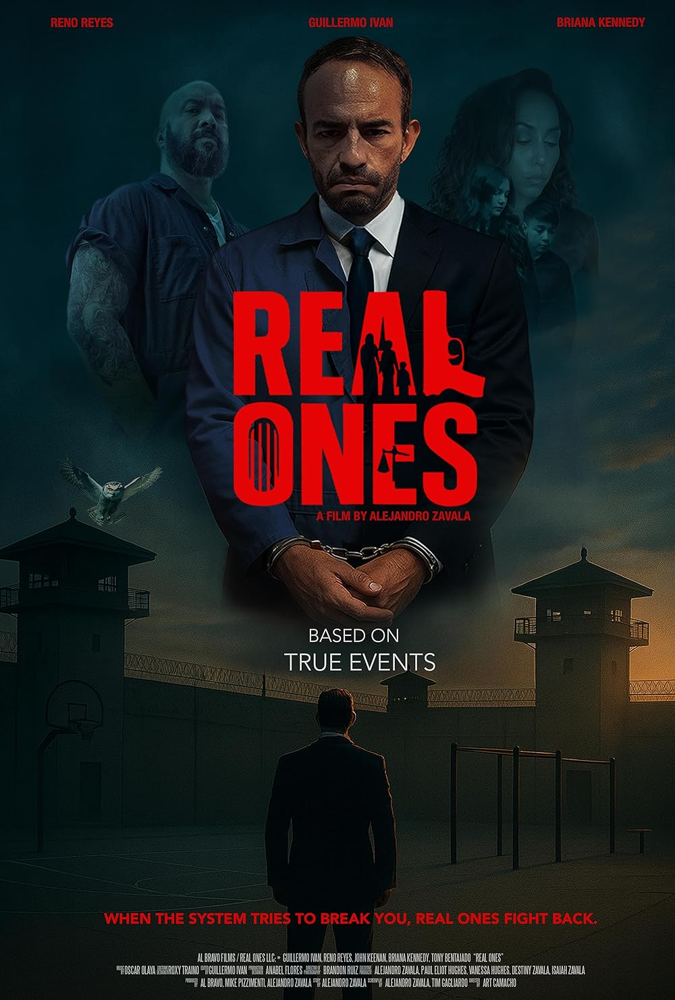
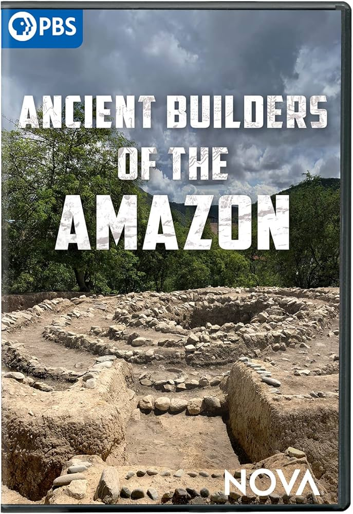
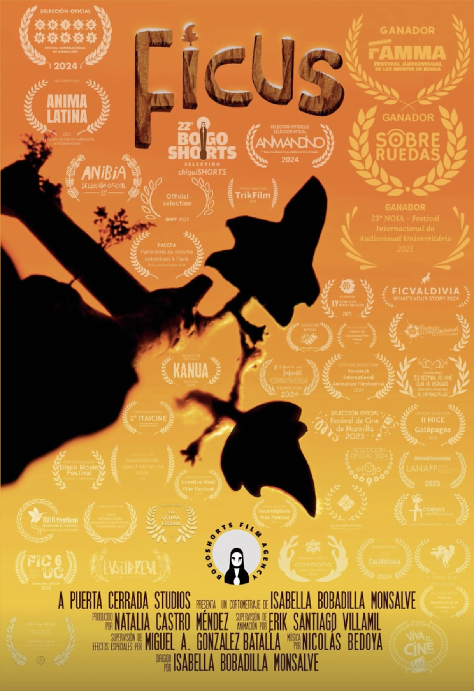
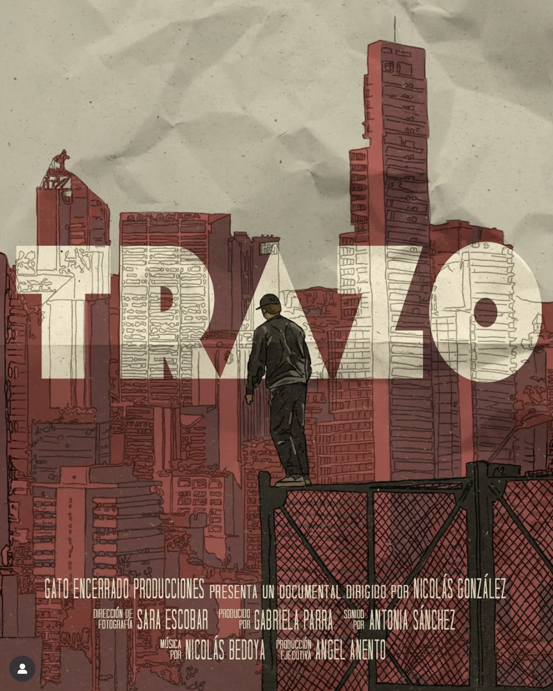
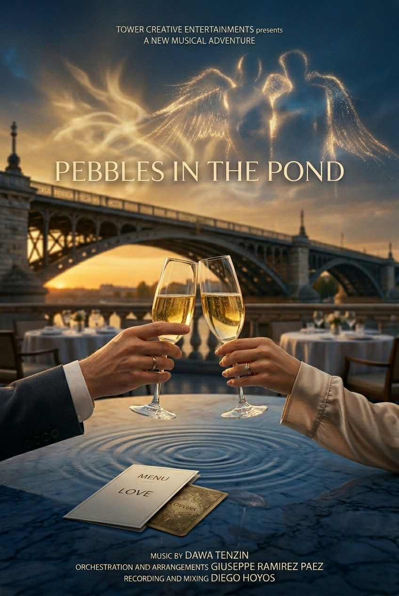

<!DOCTYPE html>
<html lang="es">
  <head>
    <meta charset="UTF-8" />
    <meta name="viewport" content="width=device-width, initial-scale=1.0" />
    <meta
      name="description"
      content="Compositorio es una agencia creativa de audio boutique para cine, TV y videojuegos."
    />
    <title>Compositorio | Agencia de Audio</title>
    <link rel="preconnect" href="https://fonts.googleapis.com" />
    <link rel="preconnect" href="https://fonts.gstatic.com" crossorigin />
    <link
      href="https://fonts.googleapis.com/css2?family=Space+Mono:wght@400;700&family=Syne:wght@500;600;700;800&display=swap"
      rel="stylesheet"
    />
    <link rel="stylesheet" href="./styles/styles.css" />
  </head>
  <body>
    <header class="site-header">
      

      <button class="nav-toggle" type="button" aria-label="Abrir navegación" aria-expanded="false">
        
        
      </button>

      <nav class="site-nav" aria-label="Navegación principal">
        <a href="#creditos">Créditos</a>
        <a href="#servicios">Servicios</a>
        <a href="#fundadores">Fundadores</a>
        <a href="#contacto">Contacto</a>
      </nav>

      <a class="header-cta" href="#contacto">Iniciar Proyecto</a>
    </header>

    <main>
      <section class="hero section" id="inicio">
        

          
        

        
Agencia sonora para medios audiovisuales.

      </section>

      <section class="section credits-section" id="creditos" aria-labelledby="creditos-title">
        

          01
          <h2 id="creditos-title">Créditos Destacados</h2>
        

        

          <button
            class="credit-card"
            type="button"
            data-title="Real Ones"
            data-role="Composición original y orquestación"
            data-image="./images/credito-01.jpg"
          >
            
            
              <strong>Real Ones</strong>
              <small>Composición original y orquestación</small>
            
          </button>

          <button
            class="credit-card"
            type="button"
            data-title="Higuita: El camino del escorpión"
            data-role="Music prep y librería musical"
            data-image="./images/credito-02.jpg"
          >
            
            
              <strong>Higuita</strong>
              <small>Music prep y librería musical</small>
            
          </button>

          <button
            class="credit-card"
            type="button"
            data-title="Los Iniciados"
            data-role="Diseño sonoro y mezcla"
            data-image="./images/credito-03.png"
          >
            
            
              <strong>Los Iniciados</strong>
              <small>Diseño sonoro y mezcla</small>
            
          </button>

          <button
            class="credit-card"
            type="button"
            data-title="Ancient Builders of the Amazon"
            data-role="Audio interactivo e implementación Wwise"
            data-image="./images/credito-04.jpg"
          >
            
            
              <strong>Ancient Builders of the Amazon</strong>
              <small>Audio interactivo e implementación Wwise</small>
            
          </button>

          <button
            class="credit-card"
            type="button"
            data-title="Ficus"
            data-role="Música original"
            data-image="./images/credito-05.png"
          >
            
            
              <strong>Ficus</strong>
              <small>Música original</small>
            
          </button>

          <button
            class="credit-card"
            type="button"
            data-title="Trazo"
            data-role="Música original"
            data-image="./images/credito-06.png"
          >
            
            
              <strong>Trazo</strong>
              <small>Música original</small>
            
          </button>

          <button
            class="credit-card"
            type="button"
            data-title="Pebbles in the Pond"
            data-role="Orquestación, arreglos, grabación y mezcla"
            data-image="./images/credito-07.png"
          >
            
            
              <strong>Pebbles in the Pond</strong>
              <small>Orquestación, arreglos, grabación y mezcla</small>
            
          </button>
        

      </section>

      <section class="section sound-section" id="sonido" aria-labelledby="sonido-title">
        

          Audio
          <h2 id="sonido-title">Escucha nuestro sonido</h2>
        

        

          <article class="audio-track">
            <button class="audio-play" type="button" data-audio="./audio/bambu.wav" aria-label="Reproducir Bambu">Play</button>
            Bambu
            <input class="audio-progress" type="range" min="0" max="100" value="0" step="0.1" aria-label="Progreso de Bambu" />
            <time>0:00</time>
          </article>
          <article class="audio-track">
            <button class="audio-play" type="button" data-audio="./audio/the-wanderer-of-valduria.mp3" aria-label="Reproducir The Wanderer of Valduria">Play</button>
            The Wanderer of Valduria
            <input class="audio-progress" type="range" min="0" max="100" value="0" step="0.1" aria-label="Progreso de The Wanderer of Valduria" />
            <time>0:00</time>
          </article>
          <article class="audio-track">
            <button class="audio-play" type="button" data-audio="./audio/holding-the-light.wav" aria-label="Reproducir Holding the Light">Play</button>
            Holding the Light
            <input class="audio-progress" type="range" min="0" max="100" value="0" step="0.1" aria-label="Progreso de Holding the Light" />
            <time>0:00</time>
          </article>
          <article class="audio-track">
            <button class="audio-play" type="button" data-audio="./audio/attack-the-sands.wav" aria-label="Reproducir Attack in the Sands">Play</button>
            Attack in the Sands
            <input class="audio-progress" type="range" min="0" max="100" value="0" step="0.1" aria-label="Progreso de Attack in the Sands" />
            <time>0:00</time>
          </article>
          <article class="audio-track">
            <button class="audio-play" type="button" data-audio="./audio/your-voice.wav" aria-label="Reproducir Your Voice">Play</button>
            Your Voice
            <input class="audio-progress" type="range" min="0" max="100" value="0" step="0.1" aria-label="Progreso de Your Voice" />
            <time>0:00</time>
          </article>
          <article class="audio-track">
            <button class="audio-play" type="button" data-audio="./audio/supernova.wav" aria-label="Reproducir Supernova">Play</button>
            Supernova
            <input class="audio-progress" type="range" min="0" max="100" value="0" step="0.1" aria-label="Progreso de Supernova" />
            <time>0:00</time>
          </article>
        

      </section>

      <section class="section services-section" id="servicios" aria-labelledby="servicios-title">
        

          02
          <h2 id="servicios-title">Servicios esenciales</h2>
        

        

          01. Music Prep &amp; Orquestación
          02. Producción Híbrida &amp; Mezcla
          03. Edición Musical &amp; Conforming
          04. Audio para Videojuegos
        

      </section>

      <section class="section team-section" id="fundadores" aria-labelledby="equipo-title">
        

          03
          <h2 id="equipo-title">Fundadores</h2>
        

        

          <article class="founder-card">
            
            

              
Fundador · Compositor · Productor

              <h3>Nicolás Bedoya</h3>
              

                Compositor, multiinstrumentista y productor especializado en música original
                para cine, teatro y videojuegos, con un enfoque que fusiona las tradiciones
                musicales colombianas con la tecnología avanzada. Es fundador y director de
                Compositorio, un colectivo de compositores para cine y teatro, y ha creado la
                música de cortometrajes galardonados e internacionalmente nominados, como
                “FICUS”.
              

              

                Entre sus créditos más destacados se encuentra la creación de orquestaciones
                digitales y arreglos para series de plataformas de streaming como “Higuita:
                El camino del escorpión” para Netflix, así como música adicional e
                instrumentos virtuales para documentales y películas. También compuso y
                produjo la banda sonora original del largometraje “El Arte de Insistir”.
              

              

                Fue galardonado con una beca para cursar la Maestría en Composición para Cine
                y Videojuegos en la Film Scoring Academy of Europe en Sofía, Bulgaria.
              

              <a href="https://nicompositor.github.io/website/" target="_blank" rel="noreferrer">Página web →</a>
            

          </article>

          <article class="founder-card">
            
            

              
Fundador · Compositor · Orquestador

              <h3>Giuseppe Ramirez</h3>
              

                Compositor, orquestador y preparador musical especializado en cine y medios
                audiovisuales. Su trabajo abarca películas independientes, largometrajes y
                colaboraciones internacionales, combinando un sólido dominio de la composición
                con enfoques contemporáneos para la música de cine.
              

              

                Su trabajo como compositor incluye bandas sonoras originales para las películas
                Apostasía, proyectada en la Cinemateca de Bogotá, y Your Voice, presentada en
                el Instituto Sueco de Cine de Estocolmo. También ha compuesto música para la
                película estadounidense Real Ones y colaborado en el desarrollo musical de Los
                Iniciados (Amazon Prime).
              

              

                En 2025 y 2026 fue seleccionado entre los 20 finalistas internacionales del
                Concurso Internacional de Música para Cine de la Facultad de Oticons.
              

              <a href="https://www.giusepperamirezpaez.com/es?utm_source=ig&utm_medium=social&utm_content=link_in_bio" target="_blank" rel="noreferrer">Página web →</a>
            

          </article>
        

      </section>

      <section class="section contact-section" id="contacto" aria-labelledby="contacto-title">
        

          04
          <h2 id="contacto-title">Contacto</h2>
        

        

          <form class="contact-form" action="mailto:hello@compositorio.com" method="post" enctype="text/plain">
            <label>
              Nombre
              <input type="text" name="nombre" autocomplete="name" required />
            </label>
            <label>
              Email
              <input type="email" name="email" autocomplete="email" required />
            </label>
            <label>
              Mensaje
              <textarea name="mensaje" rows="6" required></textarea>
            </label>
            <button type="submit">Enviar Mensaje</button>
          </form>

          <aside class="contact-direct">
            
Para proyectos, colaboraciones y disponibilidad:

            <a href="mailto:hello@compositorio.com">hello@compositorio.com</a>
            

              Bogotá
              Sofía
              Praga
            

          </aside>
        

      </section>
    </main>

    <footer class="site-footer">
      © 2026 Compositorio
      Agencia de Audio para Medios Visuales
    </footer>

    

      <button class="lightbox-close" type="button" aria-label="Cerrar">×</button>
      

        
        

          
Crédito seleccionado

          <h3></h3>
          

        

      

    

    
  </body>
</html>
